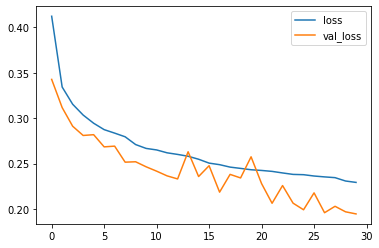

# Cifar Image Classification (Deep Learning): Project Overview 
- Created a custom convolution neural network that classified the images given in the dataset into ten different categories
- Classified the test images with 92.36% accuracy

# Overview
Using the Cifar-10 image dataset, I made a custom convolution neural network to classify the images in the test set. All images were assigned to 10 different categories; airplane, automobile, bird, cat, deer, dog, frog, horse, ship, and truck. I scaled the data, developed the neural network, and utilized early stopping and data augmentation to achieve an accuracy of 92.36%. 

